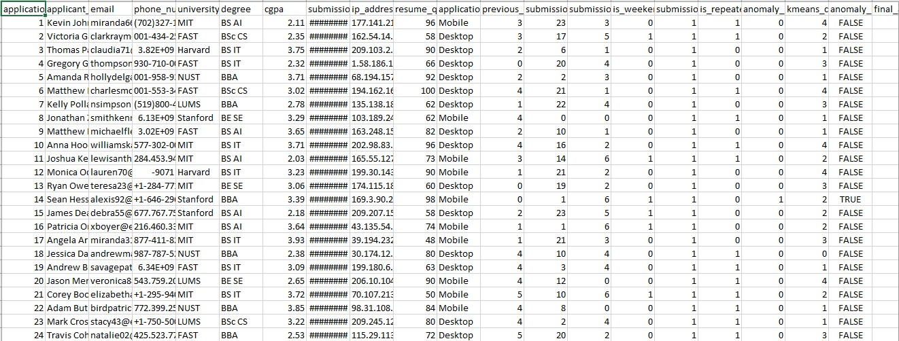
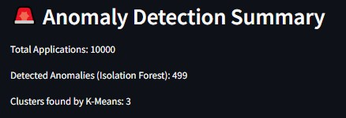
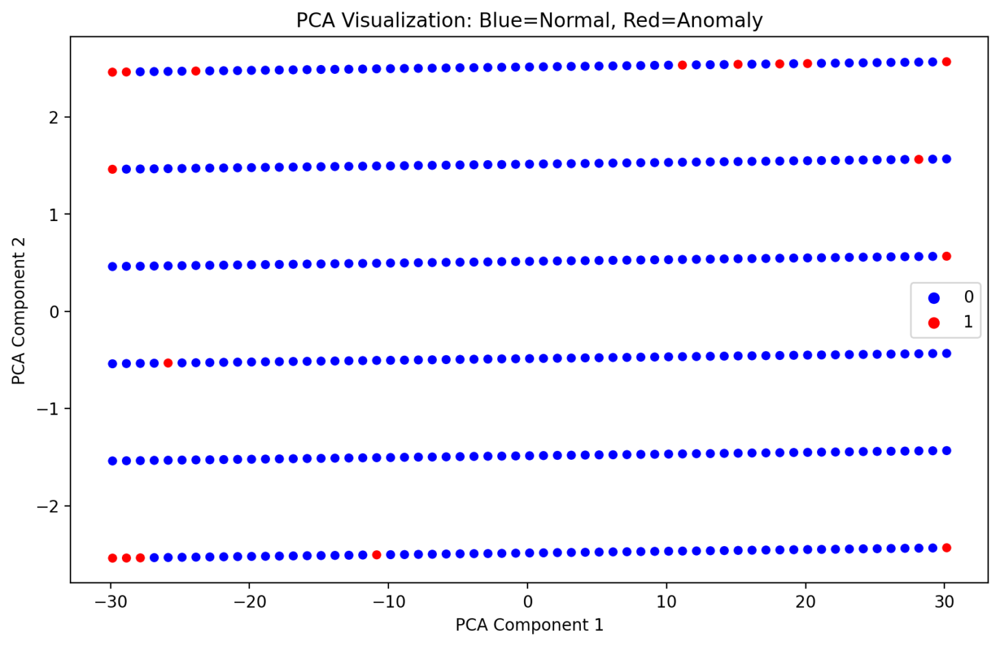
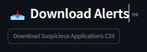

# 🕵️‍♂️ Fraud Detection in Internship Applications

This interactive Streamlit dashboard detects anomalies in internship application data using Isolation Forest and K-Means Clustering. It also includes a detailed Jupyter Notebook for exploratory data analysis and machine learning modeling.

---

## 1. 🚀 Project Title and Objective

### 📌 Project Title  
**Fraud Detection in Internship Applications**

### 🎯 Objective of the Project  
The objective of this project is to identify anomalies in internship applications to prevent fake or fraudulent entries. We aim to analyze patterns such as duplicate entries, rapid multiple submissions, and inconsistent data. Using machine learning techniques like **Isolation Forest** and **K-Means Clustering**, we detect suspicious behavior and implement alerts to flag such applications.

---

## 2. 🧠 Introduction

### 💡 Background and Motivation  
Fraudulent internship applications can undermine the recruitment process, wasting time and resources. With the increase in online application submissions, automated methods to detect suspicious applications are essential.

### ❓ Problem Statement  
How can we effectively identify fake or suspicious internship applications from large datasets using anomaly detection techniques?

### 🔒 Importance of Fraud Detection  
Detecting fraudulent applications helps maintain the integrity of the selection process, ensures genuine candidates are shortlisted, and improves overall recruitment efficiency.

---

## 3. 📊 Dataset Description

### 🔍 Overview  
The dataset contains application records from internship applicants, including personal details, submission times, and other metadata.

### 🧾 Column Descriptions  
- `application_id`: Unique identifier  
- `applicant_name`: Full name  
- `email`: Email address  
- `phone_number`: Phone contact  
- `university`: University name  
- `degree`: Degree pursued  
- `cgpa`: Academic performance  
- `submission_time`: Timestamp of application  
- `ip_address`: IP used for submission  
- `resume_quality_score`: Score assigned to resume quality  
- `application_source`: Source of submission (LinkedIn, Website, etc.)  
- `previous_applications`: Number of past applications  
- `submission_hour`, `submission_day`, `is_weekend`: Temporal features  
- `submissions_per_ip`: How many submissions from same IP  
- `is_repeated_applicant`: Boolean flag for repeat applicants  
- `anomaly_iforest`, `anomaly_kmeans`, `final_anomaly`: ML detection results  
- `pca1`, `pca2`: PCA components for 2D visualization  
- `email_dup`, `phone_dup`: Duplicate flag for contact details  
- `resume_cgpa_ratio`: Feature for assessing inflated resumes  

---

## 4. 🔧 Feature Engineering

Several features were created to help identify fraudulent behavior:
- 📅 Temporal: `submission_hour`, `submission_day`, `is_weekend`
- 📌 Behavioral: `submissions_per_ip`, `is_repeated_applicant`
- 📉 Ratio-based: `resume_cgpa_ratio`
- 📫 Duplicates: `email_dup`, `phone_dup`

---

## 5. 🤖 Machine Learning Models Used

### 🌲 Isolation Forest  
Used to detect outliers in high-dimensional feature space.

### 🔵 K-Means Clustering  
Used to identify natural clusters in applications, flagging those that are distant from majority clusters.

---

## 6. 📊 Exploratory Data Analysis (`fraud_detection.ipynb`)

The Jupyter Notebook contains:
- Visualizations (heatmaps, histograms)
- Distribution analysis of submission times
- Duplicate email and phone detection
- Resume-CGPA consistency checks
- PCA for dimensionality reduction and 2D plotting
- Side-by-side anomaly detection comparison

---

## 7. 🖼️ Streamlit Dashboard Features

The interactive dashboard includes:
- **📄 Raw Dataset Viewer**
- **🚨 Anomaly Detection Summary**
- **📉 PCA Visualization of Anomalies**
- **🔍 Filtered Suspicious Applications**
- **📥 Downloadable Alerts**

Interactive filters allow dynamic exploration of anomalies.

---

## 8. 📦 Folder Structure

Fraud_Detection/
├── app.py # Streamlit application
├── data.csv # Cleaned dataset
├── fraud_detection.ipynb # Jupyter notebook for analysis
├── requirements.txt # Dependencies
└── README.md # Project documentation

---

## 9. 📚 Requirements

All dependencies are listed in `requirements.txt`, including:

- `streamlit`
- `pandas`
- `scikit-learn`
- `matplotlib`
- `seaborn`
- `plotly`

## 10. 📸 Screenshots

Below are key visuals from the application:

  

  

  

  

---

## 11. 📂 Sample Output

- **Total Applications:** 10,000  
- **Detected Anomalies (Isolation Forest):** 499  
- **Clusters Found by K-Means:** 3  
- **Filtered Suspicious Applications:** Downloadable as CSV from the Streamlit dashboard

---

## 12. 🤝 Contributing

Contributions are welcome! Feel free to open issues or submit pull requests if you'd like to:

- 💡 Improve the dashboard UI/UX  
- 📈 Add more interactive or insightful visualizations  
- 🧠 Experiment with other clustering or anomaly detection techniques  
- 🌐 Extend the tool to other domains (e.g., scholarship, grant, or job applications)

---

## 13. 🙌 Acknowledgements

Special thanks to the following tools and libraries:

- **Streamlit** – for building the interactive web UI  
- **Scikit-learn** – for implementing machine learning models  
- **Seaborn** and **Matplotlib** – for static data visualizations  
- **Plotly** – for dynamic and interactive plots
